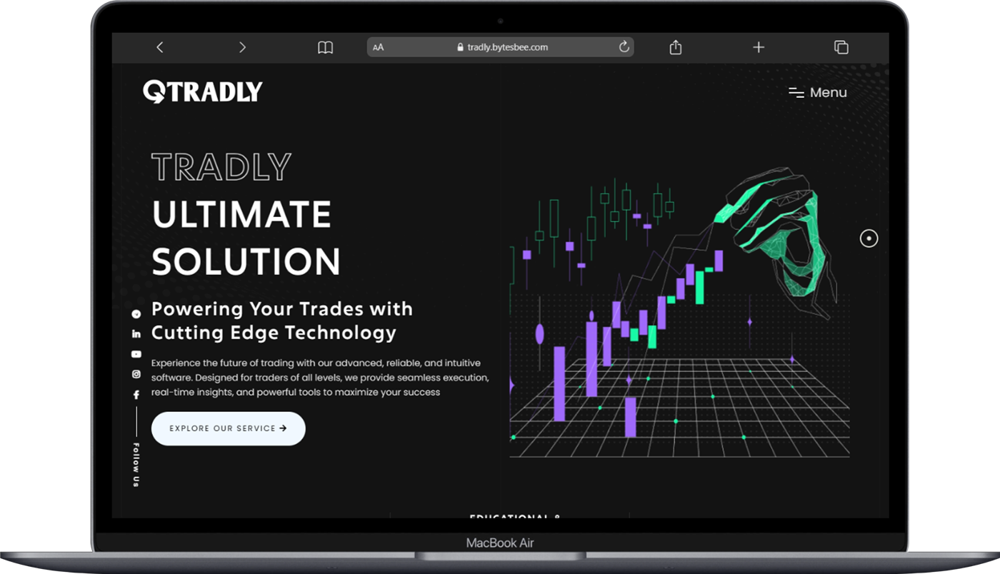
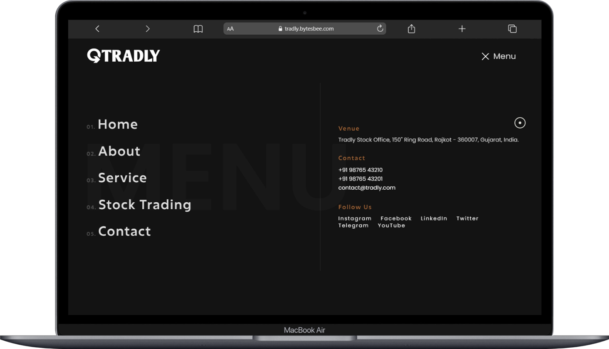

# Tradly Stock Trading Template
Tradly is a clean, super flexible, and fully responsive site. The template is built with SEO best practices in mind. It uses clean, semantical, and valid HTML, PHP, JavaScript code and CSS so search engines can index the content of your site with ease.

This is a responsive theme, able to adapt its layout to the screen size of your visitors. (Try resizing the screen and see for yourself), which means they are working super sleekly on mobile devices like iPads or iPhones.

The template comes with an extensive help file to help you understand how it works. If you encounter any problems or have questions, feel free to drop us

## Demo & Download

## [Demo](https://bit.ly/TradlyStockTemplate)

## [Download](https://bit.ly/TradlyStockTrading/)


## Key Features

- A clean, Modern Design can be used
- Responsive designs that adapts to smaller devices (iPhone, iPad)
- User-friendly.
- Advanced Header Options.
- Free Lifetime Updates and access to our support forum
- Clean Programming: Well-organized, commented & clean code
- Parallax image effect
- Fancy Menu
- Ready-to-use Contact Form
- Extensive documentation
- HTML, CSS, JavaScript, jQuery, PHP files

## 📸 Screenshots


| Screen 1 |
| ------------------------------------ |
||

| Screen 2 |
| ------------------------------------ |
||

| Screen 3 |
| ------------------------------------ |
||


## 💰 Donations

This project needs you! If you would like to support this project's further development, the creator of this project or the continuous maintenance of this project, feel free to donate. Your donation is highly appreciated (and I love food, coffee and beer). Thank you!

**PayPal**

- **[Donate \$5](https://www.paypal.me/prashantadesara/5)**: Thanks' for creating this project, here's a cup of tea (or some juice) for you!

- **[Donate \$10](https://www.paypal.me/prashantadesara/10)**: Wow, I am stunned. Let me take you to the movies!

- **[Donate \$15](https://www.paypal.me/prashantadesara/15)**: I really appreciate your work, let's grab some lunch!

- **[Donate \$25](https://www.paypal.me/prashantadesara/25)**: That's some awesome stuff you did right there, dinner is on me!

- **[Donate \$50](https://www.paypal.me/prashantadesara/50)**: I really really want to support this project, great job!

- **[Donate \$100](https://www.paypal.me/prashantadesara/100)**: You are the man! This project saved me hours (if not days) of struggle and hard work, simply awesome!

- **[Donate \$2799](https://www.paypal.me/prashantadesara/2799)**: Go buddy, buy that MacBook Pro for yourself!

  

### **BuyMeACoffee**

<a href="https://www.buymeacoffee.com/bytesbee">
</a> 

You can support me on buymeacoffee too!

Of course, you can also choose what you want to donate, all donations are awesome!


## 👨 Developed By

```
** Prashant Adesara **
```

# License
```license
Copyright 2016 Prashant Adesara

Licensed under the Apache License, Version 2.0 (the "License");
you may not use this file except in compliance with the License.
You may obtain a copy of the License at

http://www.apache.org/licenses/LICENSE-2.0

Unless required by applicable law or agreed to in writing, software
distributed under the License is distributed on an "AS IS" BASIS,
WITHOUT WARRANTIES OR CONDITIONS OF ANY KIND, either express or implied.
See the License for the specific language governing permissions and
limitations under the License.
```


